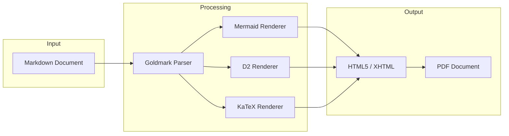

# mdflux Capabilities Demo

This document demonstrates the core rendering capabilities of mdflux. All diagrams and mathematical expressions are rendered server-side to embedded SVG, ensuring consistent display across all environments without requiring client-side JavaScript.

---

## Diagrams with Mermaid

Mermaid diagrams are rendered server-side using a headless browser, producing clean SVG output that displays identically in HTML and PDF.



---

## Architecture Diagrams with D2

D2 provides a declarative syntax for creating architecture and infrastructure diagrams, rendered directly to SVG with support for multiple layout engines.

```d2
direction: right

client: Client Application {shape: person}
gateway: API Gateway {shape: hexagon}

services: Microservices {
    auth: Authentication
    api: Core API
    worker: Background Jobs
}

storage: Data Layer {
    db: PostgreSQL {shape: cylinder}
    cache: Redis {shape: cylinder}
    queue: Message Queue {shape: queue}
}

client -> gateway: HTTPS
gateway -> services.auth: Validate
gateway -> services.api: Request
services.api -> storage.db: Query
services.api -> storage.cache: Cache
services.worker -> storage.queue: Process
```

---

## Mathematical Expressions with KaTeX

Mathematical notation is rendered using KaTeX, producing publication-quality typography for both inline and display equations.

The Fourier Transform of a function $f(t)$ is defined as:

$$
\hat{f}(\omega) = \int_{-\infty}^{\infty} f(t) \, e^{-i\omega t} \, dt
$$

This integral transforms a time-domain signal into its frequency-domain representation, where $\omega$ represents angular frequency and $i$ is the imaginary unit satisfying $i^2 = -1$.

---

## Key Advantages

- **No JavaScript Required:** All rendering occurs at build time, producing static SVG content
- **Consistent Output:** Documents render identically in HTML browsers and PDF viewers
- **Single Binary:** No Node.js or complex dependency chains required
- **Print Ready:** PDF output maintains full vector quality for diagrams and equations
