# Diagram Test Document

A comprehensive test document for various diagram syntaxes in markdown.

---

## 1. Mermaid - Flowchart

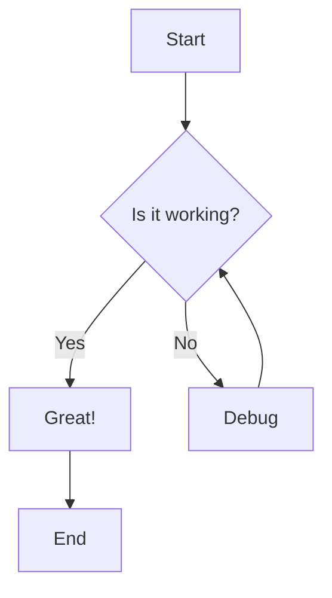

---

## 2. Mermaid - Sequence Diagram

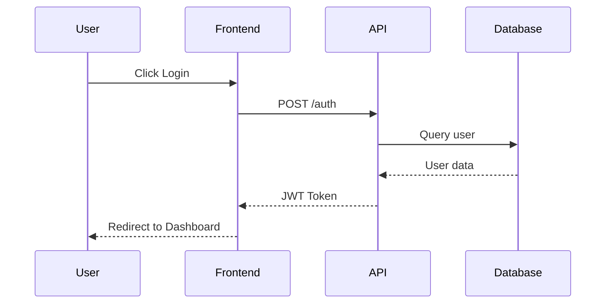

---

## 3. Mermaid - Class Diagram

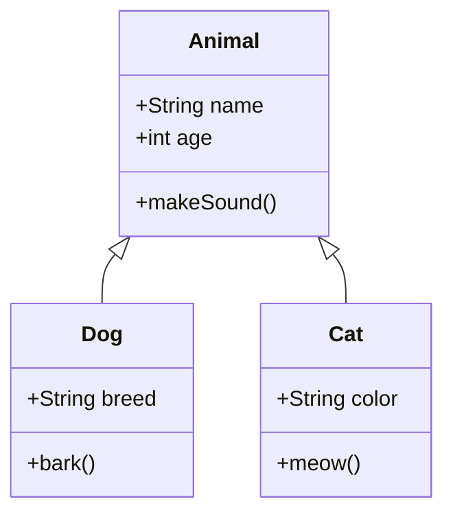

---

## 4. Mermaid - State Diagram

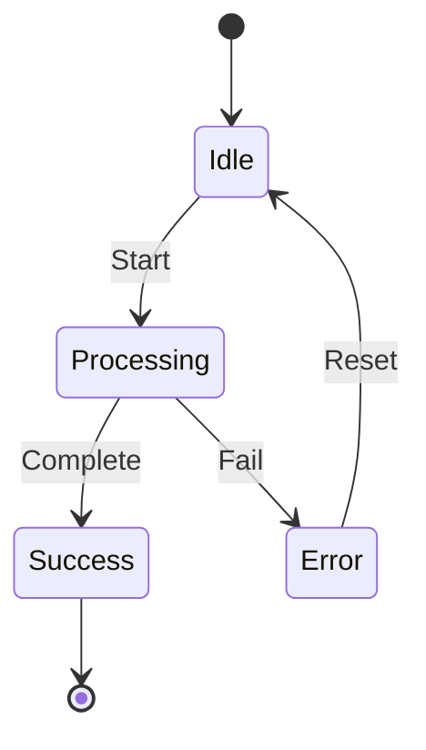

---

## 5. Mermaid - Entity Relationship

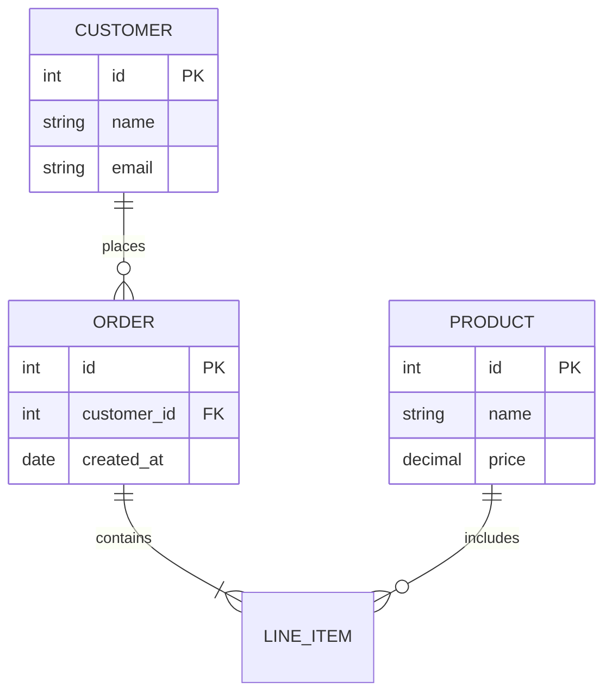

---

## 6. Mermaid - Gantt Chart

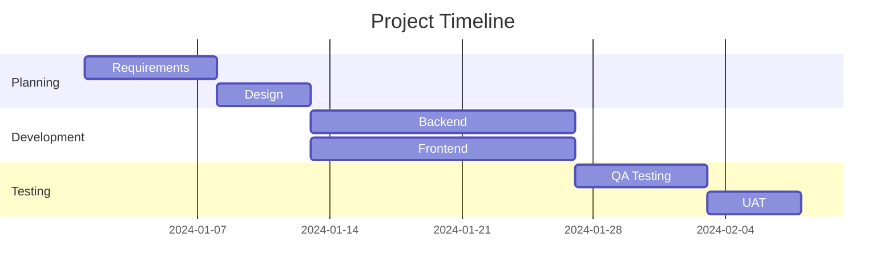

---

## 7. Mermaid - Pie Chart

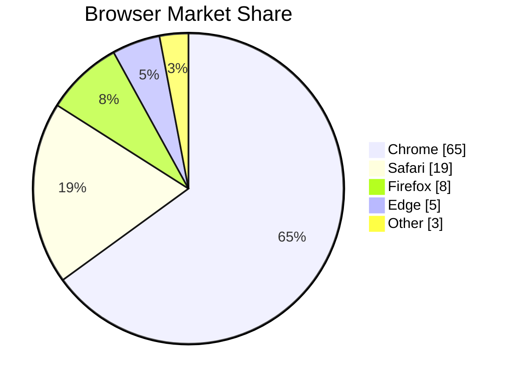

---

## 8. Mermaid - Git Graph

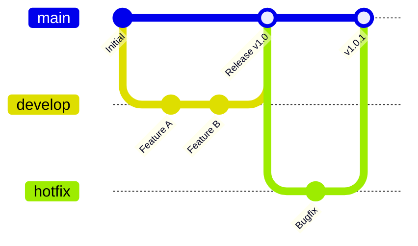

---

## 9. Mermaid - Mind Map

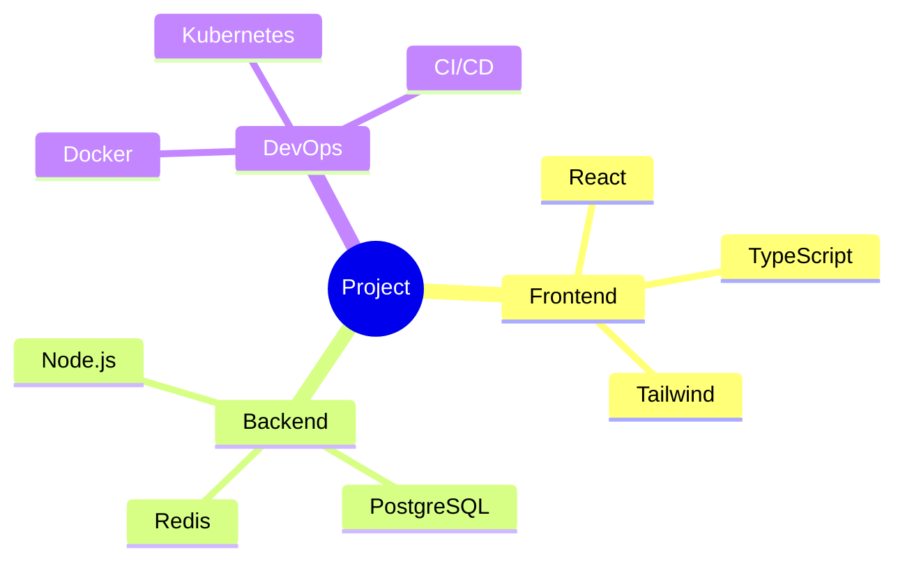

---

## 10. Mermaid - Timeline

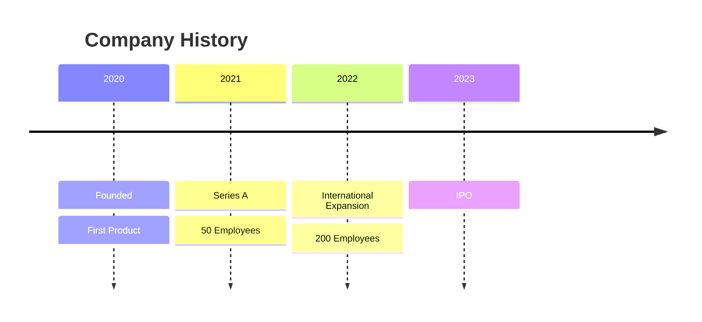

---

## 11. Mermaid - Quadrant Chart

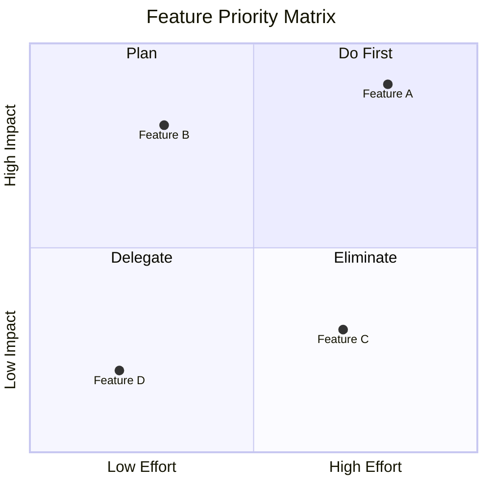

---

## 12. Mermaid - User Journey

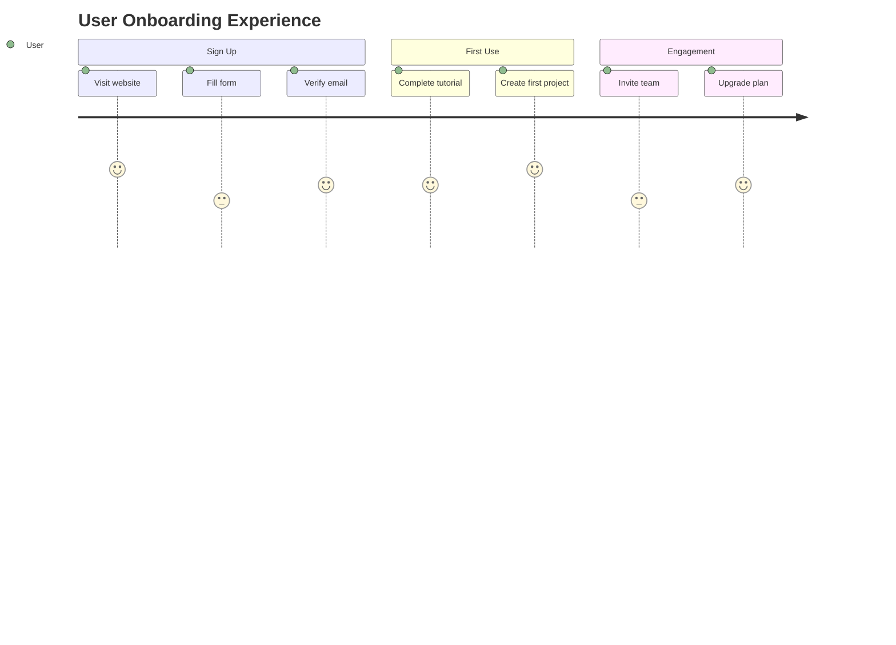

---

## 13. D2 - Architecture Diagram

```d2
direction: right

client: Client {shape: person}
cdn: CDN {shape: cloud}
lb: Load Balancer {shape: hexagon}

backend: Backend {
  api1: API Server 1
  api2: API Server 2
}

data: Data Layer {
  db: PostgreSQL {shape: cylinder}
  cache: Redis {shape: cylinder}
}

client -> cdn -> lb
lb -> backend.api1
lb -> backend.api2
backend.api1 -> data.db
backend.api2 -> data.db
backend.api1 -> data.cache
backend.api2 -> data.cache
```

---

## 14. D2 - Sequence Diagram

```d2
shape: sequence_diagram

user: User
app: Mobile App
api: REST API
db: Database

user -> app: Open App
app -> api: GET /profile
api -> db: SELECT * FROM users
db -> api: User record
api -> app: JSON response
app -> user: Display profile
```

---

## 15. D2 - Flowchart with Styles

```d2
start: Start {
  shape: oval
  style.fill: "#e8f5e9"
}

process: Process Data {
  style.fill: "#e3f2fd"
}

decision: Valid? {
  shape: diamond
  style.fill: "#fff3e0"
}

success: Success {
  style.fill: "#c8e6c9"
}

error: Error {
  style.fill: "#ffcdd2"
}

end: End {
  shape: oval
  style.fill: "#f3e5f5"
}

start -> process -> decision
decision -> success: yes
decision -> error: no
error -> process: retry
success -> end
```

---

## 16. PlantUML - Component Diagram

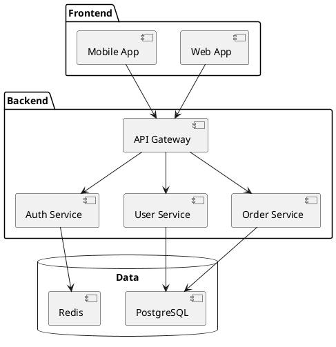

---

## 17. PlantUML - Activity Diagram

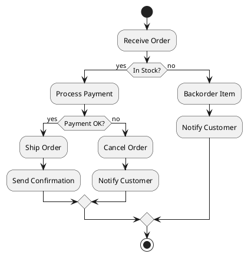

---

## 18. PlantUML - Use Case Diagram

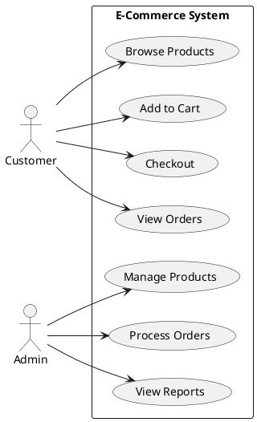

---

*End of diagram test document*
